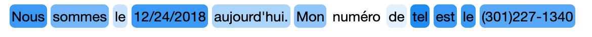
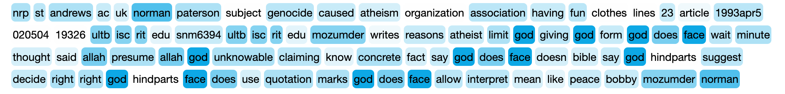
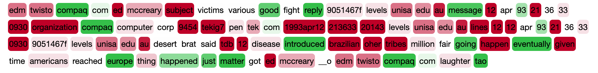

# Titulus

Text visualization python package

```python
from titulus import color, print_

test = "Nous sommes le 12/24/2018 aujourd'hui. Mon numéro de tel est le (301)227-1340"
tokens = test.split()
weights = np.random.randint(low=0, high=10, size=len(tokens))

print_(' '.join(color(tokens, weights, n=10)))
```



```python
from sklearn.datasets import fetch_20newsgroups
from sklearn.feature_extraction.text import TfidfVectorizer
from sklearn.linear_model import SGDClassifier
from sklearn.pipeline import Pipeline

categories = ['alt.atheism', 'talk.religion.misc']
newsgroups_train = fetch_20newsgroups(subset='train',
                                      categories=categories)
newsgroups_test = fetch_20newsgroups(subset='test',
                                     categories=categories)

X_train, X_test = newsgroups_train.data, newsgroups_test.data
y_train, y_test = newsgroups_train.target, newsgroups_test.target
```

```python
idx = np.random.randint(len(X_vec_list))

tokens = tokenizer(X_train[idx])
token_idx = [voc.index(t) if t in voc else -1 for t in tokens]

weights = [X_vec_arr[idx, :][i] if i>0 else 0 for i in token_idx]

print_(' '.join(color(tokens, weights, start_hex="#FEFEFE", finish_hex="#00a4e4", n=20)))
```




```python
text_clf = Pipeline([('vect', vectorizer),
                     ('clf', SGDClassifier(loss='hinge', penalty='l2', tol=0.2,
                                               alpha=1e-3, max_iter=15, random_state=42)),

                    ])

_ = text_clf.fit(X_train, y_train)

X_vec = vectorizer.transform(X_train)
X_vec_arr = X_vec.toarray()
X_vec_list = [list(x) for x in X_vec_arr]
voc = vectorizer.get_feature_names()

idx = np.random.randint(len(X_vec_list))

tokens = tokenizer(X_train[idx])
token_idx = [voc.index(t) if t in voc else -1 for t in tokens]

weights_ = np.multiply(X_vec_arr[idx, :], text_clf.named_steps['clf'].coef_[0, :])
weights = [weights_[i] if i>0 else 0 for i in token_idx]

print_(' '.join(color(tokens, weights, start_hex="#34BF49", finish_hex="#BE0027", middle_hex="#FEFEFE", n=20)))
```


